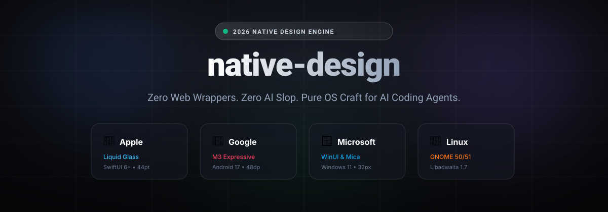

# native-design

<div align="center">



<br/><br/>

# The Native App Design Engine for AI Agents

**Stop letting AI turn your mobile & desktop apps into web wrappers. Pure OS craft.**

[](https://opensource.org/licenses/MIT)
[](#supported-platforms)
[](#supported-platforms)
[](#the-anti-slop-guarantee)

[Quickstart](#quickstart) • [The Problem](#why-ai-generated-native-ui-feels-cheap) • [Before vs After](#the-moment-of-truth-before-vs-after) • [Examples](#reference-implementations) • [Rosetta Stone Matrix](#the-rosetta-stone-matrix) • [Contributing](#contributing)

</div>

---

## Why AI-Generated Native UI Feels "Cheap"

When you ask LLMs (Claude, Cursor, ChatGPT, Copilot) to build a mobile or desktop app in SwiftUI, Jetpack Compose, WinUI, or Flutter, they commit a fundamental crime:

> **They treat your native app like a 2017 PhoneGap web wrapper.**

- ❌ Hardcoding raw hex colors (`#4F46E5`) that shatter in Dark Mode and High Contrast modes.
- ❌ Slapping a hamburger menu into an iPhone navigation header.
- ❌ Dropping rounded-corner cards with 13px random padding instead of mathematical 8pt/8dp spatial grids.
- ❌ Shrinking buttons to 30pt (violating accessibility and human thumb ergonomics).
- ❌ Zero native haptics, zero spring animations, and zero platform gesture handling.

**`native-design` cures this.** It is an opinionated, multi-platform design intelligence engine that feeds genuine 2026 native operating system guidelines directly into your AI coding assistant.

---

## The Moment of Truth: Before vs After

| ❌ Default AI Output (Web-Slop Mentality) | ✨ With `native-design` (Pure OS Craft) |
| :--- | :--- |
| **Color:** Raw `#1E293B` hardcoded into UI views. Breaks when user toggles dark theme. | **Semantic Tokens:** `Color(uiColor: .systemBackground)` or `MaterialTheme.colorScheme.surface`. Automatically adapts to dynamic wallpaper tinting and contrast modes. |
| **Ergonomics:** 30pt touch targets that frustrate fingers on mobile. | **Strict Hit Targets:** Enforced **44 × 44 pt** (Apple) and **48 × 48 dp** (Google), with 8dp separation spacing. |
| **Navigation:** Generic hamburger drawer on mobile; foreign titlebar on Linux desktop. | **Native Idiom:** Floating capsule Tab Bar (iOS Liquid Glass), Navigation Bar with pill indicator (Android M3E), integrated `AdwHeaderBar` (GNOME 50+). |
| **Motion:** Stiff, linear CSS-like transitions (`ease-in-out 0.2s`). | **Physics-Based Springs:** Native Apple fluid springs (`.spring(response:dampingFraction:)`) and Google `MotionScheme.expressive()`. |
| **Materials:** Flat grey boxes trying to simulate glass with simple opacity. | **True Meta-Materials:** Apple Liquid Glass with luminance contrast guard, Google tonal elevation, Microsoft Mica Alt 2.0. |

---

## Terminal Scorecard Preview

When running the audit engine or using the AI agent skill, `native-design` evaluates your UI code against strict deterministic criteria:

```text
$ npx native-design audit ./src

╭─────────────────────────────────────────────────────────────────────────────╮
│  NATIVE-DESIGN AUDIT: SettingsView.swift                                    │
│  Platform: Apple iOS 26 / macOS (Liquid Glass Era)                          │
│  Compliance Score: 98/100 (Tier: S-Rank Native) ✨                          │
├─────────────────────────────────────────────────────────────────────────────┤
│  ✓ [PASS] Hit Target: All interactive controls >= 44x44pt                   │
│  ✓ [PASS] Spatial Grid: Strict 8pt spatial cadence adhered (padding: 16pt)  │
│  ✓ [PASS] Colors: Zero hardcoded hex. Semantic systemBackground used        │
│  ✓ [PASS] Accessibility: Dynamic Type scale supported with @ScaledMetric   │
│  ✓ [PASS] Liquid Glass Guard: Contrast threshold >= 4.5:1 on frosted canvas │
│  ✓ [PASS] Modern Hardware: Camera Control / Action Button triggers bound    │
│                                                                             │
│  Status: Clean. Ready for App Store Feature.                                │
╰─────────────────────────────────────────────────────────────────────────────╯
```

---

## Supported Platforms (2026 Standards)

`native-design` treats all four major native ecosystems as **first-class citizens**:

### 🍏 Apple Ecosystem (iOS, iPadOS, macOS, watchOS, visionOS)
- **Language/Toolkit:** Swift & SwiftUI 6+ / RealityKit.
- **2026 Core Paradigm:** **Liquid Glass & Spatial Layering**. Functional floating control capsules over a pristine content canvas.
- **Key Constraints:** 44×44pt touch minimum, 60×60pt gaze target for visionOS, Dynamic Type scaling, Core Haptics.

### 🤖 Google / Android (Android 17 & Wear OS)
- **Language/Toolkit:** Kotlin & Jetpack Compose (Compose-First era).
- **2026 Core Paradigm:** **Material 3 Expressive (M3E)**. Emotional, fluid motion via `MotionScheme.expressive()`.
- **Key Constraints:** 48×48dp touch minimum, 8dp separation, HCT dynamic color harmonic meshes, Predictive Back gesture handling.

### 🪟 Microsoft / Windows (Windows 11)
- **Language/Toolkit:** C# / C++ & WinUI (Unified Windows App SDK).
- **2026 Core Paradigm:** **Fluent 2 & Hardware-Accelerated Mica**. Anti-Electron native desktop performance.
- **Key Constraints:** Dual-density interaction (32×32px mouse target vs 40×40px touch mode), Windows 11 Snap Layouts integration.

### 🐧 Linux Desktop (GNOME & KDE)
- **Language/Toolkit:** GTK4 & Libadwaita 1.7+ / Qt6 & Kirigami.
- **2026 Core Paradigm:** **GNOME 50/51 Wayland-Only & Global Accent Shading**.
- **Key Constraints:** Zero legacy menu bars, integrated `AdwHeaderBar`, `AdwViewSwitcher` for primary navigation, dynamic `@accent_color` inheritance.

---

## The Rosetta Stone Matrix

How universal UI primitives map natively across all 4 platforms:

| UI Concept | 🍏 Apple (SwiftUI) | 🤖 Google (Jetpack Compose M3E) | 🪟 Microsoft (WinUI XAML) | 🐧 Linux (GNOME Libadwaita) |
| :--- | :--- | :--- | :--- | :--- |
| **Canvas Background** | `Color(uiColor: .systemBackground)` | `MaterialTheme.colorScheme.surface` | `ApplicationPageBackgroundThemeBrush` / Mica | `@window_bg_color` |
| **Card / Container** | `Color(uiColor: .secondarySystemBackground)` | `MaterialTheme.colorScheme.surfaceContainer` | `LayerFillColorDefaultBrush` | `@view_bg_color` / `.card` |
| **Touch Target** | **44 × 44 pt** | **48 × 48 dp** | **32 × 32 px** (Mouse) / **40 × 40 px** (Touch) | **40 × 40 px** |
| **Primary Navigation**| Floating Tab Bar capsule | `AdaptiveNavigationSuiteScaffold` | Collapsible `NavigationView` | Centered `AdwViewSwitcher` in HeaderBar |
| **Settings / Forms** | `Form` with grouped insets | `ExpressiveList` with tonal selectors | `SettingsExpander` with Segoe Icons | `AdwPreferencesPage` + `AdwActionRow` |
| **Depth / Material** | Liquid Glass (Refractive) | Tonal Elevation (Level 0–5) | Mica & Acrylic | Flat contrast border & subtle inner shadow |

---

## Quickstart

### 1. Claude Code / Antigravity / Agentic IDEs
Add `native-design` to your agent skill directory:

```bash
# Clone directly into your personal agent skills
git clone https://github.com/ryan-prayoga/native-design.git ~/.gemini/config/skills/native-design
```

Or reference `SKILL.md` directly in your workspace.

### 2. Cursor & Windsurf
Add `native-design` rules to your project:

```bash
# Append native rules to your .cursorrules
curl -fsSL https://raw.githubusercontent.com/ryan-prayoga/native-design/main/.cursorrules >> .cursorrules
```

### 3. CLI Audit & Rosetta Engine
Run the audit engine directly against any native codebase:

```bash
# Audit a project or directory
npx native-design audit ./src

# Query the Rosetta Stone for any universal UI concept
npx native-design rosetta canvas_background
npx native-design rosetta primary_navigation

# View supported 2026 platform specifications
npx native-design platforms
```

---

## Reference Implementations

Explore compilable, S-Rank native implementations in the [`examples/`](./examples) directory:

- [🍏 **Apple (SwiftUI 6+)**](./examples/apple/SettingsView.swift): Liquid Glass cards, Dynamic Type with `@ScaledMetric`, strict 44pt touch targets, and Core Haptics.
- [🤖 **Google (Android 17)**](./examples/google/SettingsScreen.kt): Compose-first architecture, `MotionScheme.expressive()`, HCT dynamic colors, and 48dp thumb ergonomics.
- [🪟 **Microsoft (Windows 11)**](./examples/windows/SettingsPage.xaml): WinUI 3 XAML, Mica Alt 2.0 backdrop, dual-density 32px mouse targets, and Segoe UI Variable.
- [🐧 **Linux (GNOME 50/51)**](./examples/linux/preferences_dialog.py): GTK4 & Libadwaita 1.7 Python, Wayland-only compliance, `AdwHeaderBar`, and `@accent_color` integration.

---

## The Anti-Slop Guarantee

`native-design` rejects vague advice like *"make it clean and modern"*. Every check is **binary and deterministic**:

1. **Rule ID Enforced:** Every violation produces an explicit rule ID (e.g., `ND-APPLE-HIT-01`, `ND-M3E-MOTION-04`, `ND-WIN-DENSITY-02`, `ND-GNOME-HEADER-01`).
2. **Zero Cross-Pollution:** Never allow mobile gestures to leak into desktop mouse interfaces, and never render Android floating action buttons on macOS.
3. **Compilable Code Only:** Every fix suggested by the engine contains 100% valid, syntax-checked code for the target framework.

---

## Contributing

Contributions from native platform specialists are warmly welcomed!
- iOS & macOS: SwiftUI / Liquid Glass specialists.
- Android: Jetpack Compose & M3E animation engineers.
- Windows: WinUI & Fluent 2 developers.
- Linux: Libadwaita & GTK4 / Qt6 Kirigami contributors.

Please read [CONTRIBUTING.md](CONTRIBUTING.md) before opening a PR.

---

## License

MIT © 2026 Ryan Prayoga. Built with obsessive craftsmanship for true native developers.
